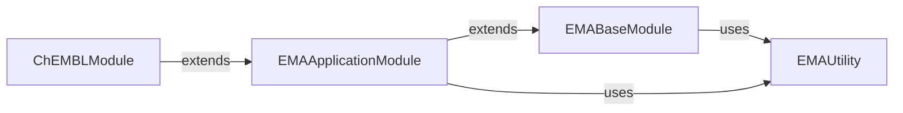

## Component Details

This component overview details the core PyTorch Lightning models for molecular docking and prediction, focusing on the integration of Exponential Moving Average (EMA) for robust model evaluation. It outlines the hierarchical structure from a base EMA module to specialized application and ChEMBL-specific modules, highlighting how EMA utility is leveraged across different stages of the model lifecycle for improved performance and metric logging.

### EMABaseModule

This component provides the foundational Exponential Moving Average (EMA) capabilities for PyTorch Lightning modules. It handles the initialization of the EMA, updates the EMA parameters during the optimization step, and manages saving and loading the EMA state during checkpoint operations.

**Related Classes/Methods**:

- <a href="https://github.com/insitro/insitro-research/blob/master/2022-del-dock/models.py#L19-L45" target="_blank" rel="noopener noreferrer">`2022-del-dock.models.LightningModule_EMABase` (19:45)</a>

- <a href="https://github.com/insitro/insitro-research/blob/master/2022-del-dock/models.py#L21-L25" target="_blank" rel="noopener noreferrer">`2022-del-dock.models.LightningModule_EMABase.configure_optimizers` (21:25)</a>

- <a href="https://github.com/insitro/insitro-research/blob/master/2022-del-dock/models.py#L27-L30" target="_blank" rel="noopener noreferrer">`2022-del-dock.models.LightningModule_EMABase.optimizer_step` (27:30)</a>

- <a href="https://github.com/insitro/insitro-research/blob/master/2022-del-dock/models.py#L32-L35" target="_blank" rel="noopener noreferrer">`2022-del-dock.models.LightningModule_EMABase.on_save_checkpoint` (32:35)</a>

- <a href="https://github.com/insitro/insitro-research/blob/master/2022-del-dock/models.py#L37-L42" target="_blank" rel="noopener noreferrer">`2022-del-dock.models.LightningModule_EMABase.on_load_checkpoint` (37:42)</a>

- <a href="https://github.com/insitro/insitro-research/blob/master/2022-del-dock/models.py#L44-L45" target="_blank" rel="noopener noreferrer">`2022-del-dock.models.LightningModule_EMABase.optimizer_zero_grad` (44:45)</a>

### EMAApplicationModule

This component extends the EMABaseModule to apply Exponential Moving Average (EMA) specifically during the validation, testing, and prediction phases of a model's lifecycle. It ensures that model evaluations and predictions are performed using the averaged parameters, which often leads to more robust results.

**Related Classes/Methods**:

- <a href="https://github.com/insitro/insitro-research/blob/master/2022-del-dock/models.py#L48-L73" target="_blank" rel="noopener noreferrer">`2022-del-dock.models.EMA_module` (48:73)</a>

- <a href="https://github.com/insitro/insitro-research/blob/master/2022-del-dock/models.py#L49-L62" target="_blank" rel="noopener noreferrer">`2022-del-dock.models.EMA_module.validation_step` (49:62)</a>

- <a href="https://github.com/insitro/insitro-research/blob/master/2022-del-dock/models.py#L64-L67" target="_blank" rel="noopener noreferrer">`2022-del-dock.models.EMA_module.test_step` (64:67)</a>

- <a href="https://github.com/insitro/insitro-research/blob/master/2022-del-dock/models.py#L69-L73" target="_blank" rel="noopener noreferrer">`2022-del-dock.models.EMA_module.predict_step` (69:73)</a>

### EMAUtility

This is a core utility component responsible for maintaining and applying the Exponential Moving Average (EMA) of model parameters. It provides methods to update the averaged parameters and to temporarily use these averaged parameters for evaluation or prediction, ensuring consistent model behavior.

**Related Classes/Methods**:

- <a href="https://github.com/insitro/insitro-research/blob/master/2022-del-dock/ema.py#L16-L276" target="_blank" rel="noopener noreferrer">`2022-del-dock.ema.ExponentialMovingAverage` (16:276)</a>

- <a href="https://github.com/insitro/insitro-research/blob/master/2022-del-dock/ema.py#L73-L98" target="_blank" rel="noopener noreferrer">`2022-del-dock.ema.ExponentialMovingAverage.update` (73:98)</a>

- <a href="https://github.com/insitro/insitro-research/blob/master/2022-del-dock/ema.py#L158-L185" target="_blank" rel="noopener noreferrer">`2022-del-dock.ema.ExponentialMovingAverage.average_parameters` (158:185)</a>

- <a href="https://github.com/insitro/insitro-research/blob/master/2022-del-dock/ema.py#L209-L219" target="_blank" rel="noopener noreferrer">`2022-del-dock.ema.ExponentialMovingAverage.state_dict` (209:219)</a>

- <a href="https://github.com/insitro/insitro-research/blob/master/2022-del-dock/ema.py#L221-L276" target="_blank" rel="noopener noreferrer">`2022-del-dock.ema.ExponentialMovingAverage.load_state_dict` (221:276)</a>

### ChEMBLModule

This component extends EMAApplicationModule to specifically handle ChEMBL dataset related tasks, including calculating and logging Pearson and Spearman correlations for evaluation, and handling specific data processing and logging for ChEMBL targets and matrix effects.

**Related Classes/Methods**:

- <a href="https://github.com/insitro/insitro-research/blob/master/2022-del-dock/models.py#L76-L200" target="_blank" rel="noopener noreferrer">`2022-del-dock.models.EMA_ChEMBL_module` (76:200)</a>

- <a href="https://github.com/insitro/insitro-research/blob/master/2022-del-dock/models.py#L78-L90" target="_blank" rel="noopener noreferrer">`2022-del-dock.models.EMA_ChEMBL_module._get_pearson_spearman` (78:90)</a>

- <a href="https://github.com/insitro/insitro-research/blob/master/2022-del-dock/models.py#L92-L99" target="_blank" rel="noopener noreferrer">`2022-del-dock.models.EMA_ChEMBL_module._common_eval_step` (92:99)</a>

- <a href="https://github.com/insitro/insitro-research/blob/master/2022-del-dock/models.py#L101-L104" target="_blank" rel="noopener noreferrer">`2022-del-dock.models.EMA_ChEMBL_module._log_pearson_spearman` (101:104)</a>

- <a href="https://github.com/insitro/insitro-research/blob/master/2022-del-dock/models.py#L106-L113" target="_blank" rel="noopener noreferrer">`2022-del-dock.models.EMA_ChEMBL_module.validation_step` (106:113)</a>

- <a href="https://github.com/insitro/insitro-research/blob/master/2022-del-dock/models.py#L115-L185" target="_blank" rel="noopener noreferrer">`2022-del-dock.models.EMA_ChEMBL_module.validation_epoch_end` (115:185)</a>

- <a href="https://github.com/insitro/insitro-research/blob/master/2022-del-dock/models.py#L187-L194" target="_blank" rel="noopener noreferrer">`2022-del-dock.models.EMA_ChEMBL_module.test_step` (187:194)</a>

- <a href="https://github.com/insitro/insitro-research/blob/master/2022-del-dock/models.py#L196-L200" target="_blank" rel="noopener noreferrer">`2022-del-dock.models.EMA_ChEMBL_module.test_epoch_end` (196:200)</a>

### [FAQ](https://github.com/CodeBoarding/GeneratedOnBoardings/tree/main?tab=readme-ov-file#faq)