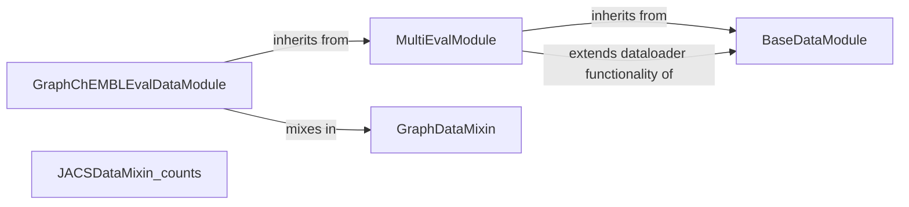

## Component Details

This module is responsible for handling all aspects of data loading, preprocessing, and splitting for training, validation, and evaluation. It prepares the input data (e.g., molecular fingerprints, CNN features, target counts) for the machine learning models.

### BaseDataModule

This component serves as a foundational data module, responsible for setting up basic data loading functionalities. It handles the splitting of data into training, validation, and test sets, and provides a generic method `_get_dataloader` for creating PyTorch DataLoader instances. It also defines standard `train_dataloader`, `val_dataloader`, and `test_dataloader` methods that utilize the generic `_get_dataloader`.

**Related Classes/Methods**:

- <a href="https://github.com/insitro/insitro-research/blob/master/2022-del-dock/datamodules.py#L14-L63" target="_blank" rel="noopener noreferrer">`2022-del-dock.datamodules.BaseDataModule` (14:63)</a>

- <a href="https://github.com/insitro/insitro-research/blob/master/2022-del-dock/datamodules.py#L15-L39" target="_blank" rel="noopener noreferrer">`2022-del-dock.datamodules.BaseDataModule.__init__` (15:39)</a>

- <a href="https://github.com/insitro/insitro-research/blob/master/2022-del-dock/datamodules.py#L41-L48" target="_blank" rel="noopener noreferrer">`2022-del-dock.datamodules.BaseDataModule._get_dataloader` (41:48)</a>

- <a href="https://github.com/insitro/insitro-research/blob/master/2022-del-dock/datamodules.py#L50-L53" target="_blank" rel="noopener noreferrer">`2022-del-dock.datamodules.BaseDataModule.train_dataloader` (50:53)</a>

- <a href="https://github.com/insitro/insitro-research/blob/master/2022-del-dock/datamodules.py#L55-L58" target="_blank" rel="noopener noreferrer">`2022-del-dock.datamodules.BaseDataModule.val_dataloader` (55:58)</a>

- <a href="https://github.com/insitro/insitro-research/blob/master/2022-del-dock/datamodules.py#L60-L63" target="_blank" rel="noopener noreferrer">`2022-del-dock.datamodules.BaseDataModule.test_dataloader` (60:63)</a>

### MultiEvalModule

This component extends the `BaseDataModule` to provide enhanced evaluation capabilities. It introduces an additional evaluation dataloader (`_get_eval_loader`) and modifies the `val_dataloader` and `test_dataloader` methods to return a list containing both the standard validation/test loader from the base class and its own evaluation loader. This allows for multiple evaluation sets during validation and testing phases.

**Related Classes/Methods**:

- <a href="https://github.com/insitro/insitro-research/blob/master/2022-del-dock/datamodules.py#L66-L84" target="_blank" rel="noopener noreferrer">`2022-del-dock.datamodules.MultiEvalModule` (66:84)</a>

- <a href="https://github.com/insitro/insitro-research/blob/master/2022-del-dock/datamodules.py#L67-L72" target="_blank" rel="noopener noreferrer">`2022-del-dock.datamodules.MultiEvalModule._get_eval_loader` (67:72)</a>

- <a href="https://github.com/insitro/insitro-research/blob/master/2022-del-dock/datamodules.py#L74-L78" target="_blank" rel="noopener noreferrer">`2022-del-dock.datamodules.MultiEvalModule.val_dataloader` (74:78)</a>

- <a href="https://github.com/insitro/insitro-research/blob/master/2022-del-dock/datamodules.py#L80-L84" target="_blank" rel="noopener noreferrer">`2022-del-dock.datamodules.MultiEvalModule.test_dataloader` (80:84)</a>

### GraphDataMixin

This mixin provides functionalities for handling graph-structured data. It includes methods for loading graph data from a specified path, creating a dataset from the loaded data, and defining properties for the number of points and the dataset itself. It also includes a `prepare_data` method for data preparation.

**Related Classes/Methods**:

- <a href="https://github.com/insitro/insitro-research/blob/master/2022-del-dock/datamodules.py#L87-L143" target="_blank" rel="noopener noreferrer">`2022-del-dock.datamodules.GraphDataMixin` (87:143)</a>

- <a href="https://github.com/insitro/insitro-research/blob/master/2022-del-dock/datamodules.py#L88-L91" target="_blank" rel="noopener noreferrer">`2022-del-dock.datamodules.GraphDataMixin.__init__` (88:91)</a>

- <a href="https://github.com/insitro/insitro-research/blob/master/2022-del-dock/datamodules.py#L93-L100" target="_blank" rel="noopener noreferrer">`2022-del-dock.datamodules.GraphDataMixin.load_data` (93:100)</a>

- <a href="https://github.com/insitro/insitro-research/blob/master/2022-del-dock/datamodules.py#L102-L110" target="_blank" rel="noopener noreferrer">`2022-del-dock.datamodules.GraphDataMixin.create_dataset` (102:110)</a>

- <a href="https://github.com/insitro/insitro-research/blob/master/2022-del-dock/datamodules.py#L112-L115" target="_blank" rel="noopener noreferrer">`2022-del-dock.datamodules.GraphDataMixin.num_pts` (112:115)</a>

- <a href="https://github.com/insitro/insitro-research/blob/master/2022-del-dock/datamodules.py#L117-L120" target="_blank" rel="noopener noreferrer">`2022-del-dock.datamodules.GraphDataMixin.dataset` (117:120)</a>

- <a href="https://github.com/insitro/insitro-research/blob/master/2022-del-dock/datamodules.py#L122-L143" target="_blank" rel="noopener noreferrer">`2022-del-dock.datamodules.GraphDataMixin.prepare_data` (122:143)</a>

### GraphChEMBLEvalDataModule

This component is a specialized data module for graph-based ChEMBL evaluation data. It inherits from both `GraphDataMixin` and `MultiEvalModule`, combining graph data handling with multi-evaluation capabilities. It specifically loads ChEMBL evaluation data and prepares it for use in models.

**Related Classes/Methods**:

- <a href="https://github.com/insitro/insitro-research/blob/master/2022-del-dock/datamodules.py#L146-L177" target="_blank" rel="noopener noreferrer">`2022-del-dock.datamodules.GraphChEMBLEvalDataModule` (146:177)</a>

- <a href="https://github.com/insitro/insitro-research/blob/master/2022-del-dock/datamodules.py#L147-L154" target="_blank" rel="noopener noreferrer">`2022-del-dock.datamodules.GraphChEMBLEvalDataModule.__init__` (147:154)</a>

- <a href="https://github.com/insitro/insitro-research/blob/master/2022-del-dock/datamodules.py#L156-L163" target="_blank" rel="noopener noreferrer">`2022-del-dock.datamodules.GraphChEMBLEvalDataModule.load_eval_data` (156:163)</a>

- <a href="https://github.com/insitro/insitro-research/blob/master/2022-del-dock/datamodules.py#L165-L173" target="_blank" rel="noopener noreferrer">`2022-del-dock.datamodules.GraphChEMBLEvalDataModule.create_eval_dataset` (165:173)</a>

- <a href="https://github.com/insitro/insitro-research/blob/master/2022-del-dock/datamodules.py#L175-L177" target="_blank" rel="noopener noreferrer">`2022-del-dock.datamodules.GraphChEMBLEvalDataModule.eval_dataset` (175:177)</a>

### JACSDataMixin_counts

This mixin is designed for handling JACS (Journal of the American Chemical Society) dataset with count data. It provides methods for loading JACS data, creating a dataset from it, and defining properties for the number of points and the dataset itself. It also includes a `prepare_data` method for data preparation specific to JACS counts.

**Related Classes/Methods**:

- <a href="https://github.com/insitro/insitro-research/blob/master/2022-del-dock/datamodules.py#L180-L217" target="_blank" rel="noopener noreferrer">`2022-del-dock.datamodules.JACSDataMixin_counts` (180:217)</a>

- <a href="https://github.com/insitro/insitro-research/blob/master/2022-del-dock/datamodules.py#L181-L184" target="_blank" rel="noopener noreferrer">`2022-del-dock.datamodules.JACSDataMixin_counts.__init__` (181:184)</a>

- <a href="https://github.com/insitro/insitro-research/blob/master/2022-del-dock/datamodules.py#L186-L193" target="_blank" rel="noopener noreferrer">`2022-del-dock.datamodules.JACSDataMixin_counts.load_data` (186:193)</a>

- <a href="https://github.com/insitro/insitro-research/blob/master/2022-del-dock/datamodules.py#L195-L203" target="_blank" rel="noopener noreferrer">`2022-del-dock.datamodules.JACSDataMixin_counts.create_dataset` (195:203)</a>

- <a href="https://github.com/insitro/insitro-research/blob/master/2022-del-dock/datamodules.py#L205-L208" target="_blank" rel="noopener noreferrer">`2022-del-dock.datamodules.JACSDataMixin_counts.num_pts` (205:208)</a>

- <a href="https://github.com/insitro/insitro-research/blob/master/2022-del-dock/datamodules.py#L210-L213" target="_blank" rel="noopener noreferrer">`2022-del-dock.datamodules.JACSDataMixin_counts.dataset` (210:213)</a>

- <a href="https://github.com/insitro/insitro-research/blob/master/2022-del-dock/datamodules.py#L215-L217" target="_blank" rel="noopener noreferrer">`2022-del-dock.datamodules.JACSDataMixin_counts.prepare_data` (215:217)</a>

### [FAQ](https://github.com/CodeBoarding/GeneratedOnBoardings/tree/main?tab=readme-ov-file#faq)