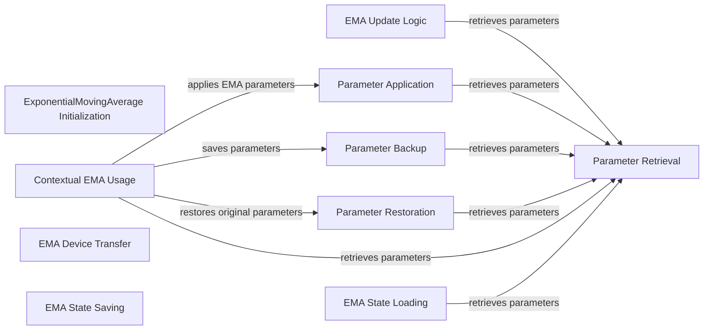

## Component Details

This module provides the implementation for Exponential Moving Average (EMA), a technique used to maintain a moving average of model parameters. EMA helps stabilize training and often leads to improved generalization performance. The core functionality revolves around initializing EMA, updating shadow parameters, applying them to the model, and managing their state for saving and loading, often within a contextual manager for temporary application.

### ExponentialMovingAverage Initialization

This component initializes the Exponential Moving Average (EMA) object, setting up the decay rate, update counter, and creating initial shadow parameters from the provided model parameters, maintaining weak references to prevent memory leaks.

**Related Classes/Methods**:

- <a href="https://github.com/insitro/insitro-research/blob/master/2022-del-dock/ema.py#L28-L46" target="_blank" rel="noopener noreferrer">`2022-del-dock.ema.ExponentialMovingAverage.__init__` (28:46)</a>

### Parameter Retrieval

This utility method is responsible for safely retrieving the current set of model parameters, either from internal weak references or from an explicitly provided iterable, ensuring that parameters are still valid and accessible.

**Related Classes/Methods**:

- <a href="https://github.com/insitro/insitro-research/blob/master/2022-del-dock/ema.py#L48-L71" target="_blank" rel="noopener noreferrer">`2022-del-dock.ema.ExponentialMovingAverage._get_parameters` (48:71)</a>

### EMA Update Logic

This component implements the core exponential moving average logic, updating the internal shadow parameters based on the latest model parameters, optionally adjusting the decay based on the number of updates.

**Related Classes/Methods**:

- <a href="https://github.com/insitro/insitro-research/blob/master/2022-del-dock/ema.py#L73-L98" target="_blank" rel="noopener noreferrer">`2022-del-dock.ema.ExponentialMovingAverage.update` (73:98)</a>

### Parameter Application

This component is responsible for copying the currently averaged shadow parameters into the actual model parameters, effectively applying the EMA state to the model.

**Related Classes/Methods**:

- <a href="https://github.com/insitro/insitro-research/blob/master/2022-del-dock/ema.py#L100-L115" target="_blank" rel="noopener noreferrer">`2022-del-dock.ema.ExponentialMovingAverage.copy_to` (100:115)</a>

### Parameter Backup

This component temporarily saves the current state of the model's parameters, creating a snapshot that can be restored later, typically used before applying EMA parameters for validation.

**Related Classes/Methods**:

- <a href="https://github.com/insitro/insitro-research/blob/master/2022-del-dock/ema.py#L117-L129" target="_blank" rel="noopener noreferrer">`2022-del-dock.ema.ExponentialMovingAverage.store` (117:129)</a>

### Parameter Restoration

This component reverts the model's parameters to a previously saved state, using the parameters stored by the `store` method, which is crucial for restoring the original model state after validation with EMA parameters.

**Related Classes/Methods**:

- <a href="https://github.com/insitro/insitro-research/blob/master/2022-del-dock/ema.py#L131-L155" target="_blank" rel="noopener noreferrer">`2022-del-dock.ema.ExponentialMovingAverage.restore` (131:155)</a>

### Contextual EMA Usage

This component provides a context manager that simplifies the process of temporarily using EMA parameters for tasks like validation or inference by automatically storing, applying, and then restoring the original model parameters.

**Related Classes/Methods**:

- <a href="https://github.com/insitro/insitro-research/blob/master/2022-del-dock/ema.py#L158-L185" target="_blank" rel="noopener noreferrer">`2022-del-dock.ema.ExponentialMovingAverage.average_parameters` (158:185)</a>

### EMA Device Transfer

This component handles moving the internal buffers (shadow and collected parameters) of the EMA to a specified device (e.g., CPU or GPU) and optionally changes their data type.

**Related Classes/Methods**:

- <a href="https://github.com/insitro/insitro-research/blob/master/2022-del-dock/ema.py#L187-L207" target="_blank" rel="noopener noreferrer">`2022-del-dock.ema.ExponentialMovingAverage.to` (187:207)</a>

### EMA State Saving

This component serializes the EMA's internal state, including decay, update count, and shadow/collected parameters, allowing the EMA object to be saved to a checkpoint.

**Related Classes/Methods**:

- <a href="https://github.com/insitro/insitro-research/blob/master/2022-del-dock/ema.py#L209-L219" target="_blank" rel="noopener noreferrer">`2022-del-dock.ema.ExponentialMovingAverage.state_dict` (209:219)</a>

### EMA State Loading

This component handles the deserialization of the EMA's internal state, including decay, update count, and shadow/collected parameters, allowing the EMA object to be restored from a saved checkpoint.

**Related Classes/Methods**:

- <a href="https://github.com/insitro/insitro-research/blob/master/2022-del-dock/ema.py#L221-L276" target="_blank" rel="noopener noreferrer">`2022-del-dock.ema.ExponentialMovingAverage.load_state_dict` (221:276)</a>

### [FAQ](https://github.com/CodeBoarding/GeneratedOnBoardings/tree/main?tab=readme-ov-file#faq)