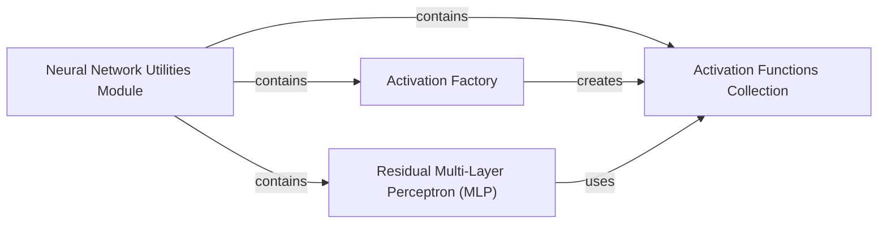

## Component Details

This subsystem, primarily encapsulated within the `2022-del-dock.utils` module, provides fundamental building blocks for neural networks. It includes a flexible Activation Factory for dynamic retrieval of various activation functions (both standard and custom like `ExpAct`), and a robust `ResidualNLayerMLP` component that facilitates the construction of deep neural networks with improved training stability through residual connections. The overall purpose is to offer reusable and configurable utilities that serve as foundational elements for more complex models within the project.

### Neural Network Utilities Module

This module (`2022-del-dock.utils`) serves as a central repository for general-purpose utility functions and classes essential for building neural networks. It encompasses a factory for dynamic activation function retrieval, custom activation implementations, and a robust multi-layer perceptron with residual connections, acting as foundational elements for higher-level models.

**Related Classes/Methods**:

- <a href="https://github.com/insitro/insitro-research/blob/master/2022-del-dock/utils.py#L7-L12" target="_blank" rel="noopener noreferrer">`2022-del-dock.utils.ExpAct` (7:12)</a>

- <a href="https://github.com/insitro/insitro-research/blob/master/2022-del-dock/utils.py#L27-L28" target="_blank" rel="noopener noreferrer">`2022-del-dock.utils.activation_factory` (27:28)</a>

- <a href="https://github.com/insitro/insitro-research/blob/master/2022-del-dock/utils.py#L31-L52" target="_blank" rel="noopener noreferrer">`2022-del-dock.utils.ResidualNLayerMLP` (31:52)</a>

### Activation Factory

The Activation Factory component, implemented by the `activation_factory` function, is responsible for dynamically providing specific activation functions based on a given string identifier. It centralizes the management and instantiation of various activation functions, ensuring flexibility and reusability across neural network models.

**Related Classes/Methods**:

- <a href="https://github.com/insitro/insitro-research/blob/master/2022-del-dock/utils.py#L27-L28" target="_blank" rel="noopener noreferrer">`2022-del-dock.utils.activation_factory` (27:28)</a>

### Activation Functions Collection

This component represents the diverse set of activation functions available for use in neural networks. It includes standard PyTorch activations (e.g., ReLU, LeakyReLU, GELU, Identity) and custom implementations like `ExpAct`. These functions, primarily managed through the `activations` dictionary, introduce non-linearity crucial for learning complex patterns and are retrieved by the Activation Factory.

**Related Classes/Methods**:

- <a href="https://github.com/insitro/insitro-research/blob/master/2022-del-dock/utils.py#L7-L12" target="_blank" rel="noopener noreferrer">`2022-del-dock.utils.ExpAct` (7:12)</a>

- `torch.nn.ReLU` (full file reference)

- `torch.nn.LeakyReLU` (full file reference)

- `torch.nn.Softplus` (full file reference)

- `torch.nn.GELU` (full file reference)

- `torch.nn.ELU` (full file reference)

- `torch.nn.Sigmoid` (full file reference)

- `torch.nn.Identity` (full file reference)

### Residual Multi-Layer Perceptron (MLP)

The Residual Multi-Layer Perceptron (MLP) component, implemented as `ResidualNLayerMLP`, provides a configurable neural network block with residual connections. This design facilitates the training of deeper models by improving gradient flow and stability. It integrates activation functions, typically sourced from the Activation Factory, to introduce non-linearity in its layers.

**Related Classes/Methods**:

- <a href="https://github.com/insitro/insitro-research/blob/master/2022-del-dock/utils.py#L31-L52" target="_blank" rel="noopener noreferrer">`2022-del-dock.utils.ResidualNLayerMLP` (31:52)</a>

### [FAQ](https://github.com/CodeBoarding/GeneratedOnBoardings/tree/main?tab=readme-ov-file#faq)