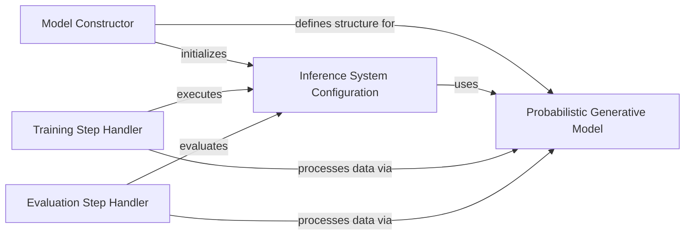

## Component Details

This module extends the core modeling capabilities by incorporating probabilistic programming using the Pyro library. It defines models that can handle count data and perform variational inference, providing a Bayesian approach to predictions. The main flow involves constructing the probabilistic model, configuring the inference system, and then iteratively training and evaluating the model using the defined steps.

### Model Constructor

Handles the initial setup of the PyroModel, including the neural network layers and the instantiation of the Pyro SVI (Stochastic Variational Inference) system.

**Related Classes/Methods**:

- <a href="https://github.com/insitro/insitro-research/blob/master/2022-del-dock/pyro_models.py#L12-L14" target="_blank" rel="noopener noreferrer">`2022-del-dock.pyro_models.PyroModel.__init__` (12:14)</a>

- <a href="https://github.com/insitro/insitro-research/blob/master/2022-del-dock/pyro_models.py#L16-L35" target="_blank" rel="noopener noreferrer">`2022-del-dock.pyro_models.PyroModel._init_pyro_model` (16:35)</a>

### Probabilistic Generative Model

Defines the core probabilistic model using Pyro, specifying the likelihood of observed data (matrix and target counts) given the model's parameters, often involving ZeroInflatedPoisson distributions.

**Related Classes/Methods**:

- <a href="https://github.com/insitro/insitro-research/blob/master/2022-del-dock/pyro_models.py#L37-L66" target="_blank" rel="noopener noreferrer">`2022-del-dock.pyro_models.PyroModel.pyro_model` (37:66)</a>

### Inference System Configuration

Sets up the inference algorithm, specifically Stochastic Variational Inference (SVI), by defining the optimizer (ClippedAdam), the variational guide (AutoNormal), and the ELBO loss function.

**Related Classes/Methods**:

- <a href="https://github.com/insitro/insitro-research/blob/master/2022-del-dock/pyro_models.py#L68-L84" target="_blank" rel="noopener noreferrer">`2022-del-dock.pyro_models.PyroModel._get_pyro_svi` (68:84)</a>

### Training Step Handler

Manages a single iteration of the training process, performing a step of the SVI algorithm to update model parameters and logging the training loss.

**Related Classes/Methods**:

- <a href="https://github.com/insitro/insitro-research/blob/master/2022-del-dock/pyro_models.py#L86-L96" target="_blank" rel="noopener noreferrer">`2022-del-dock.pyro_models.PyroModel.training_step` (86:96)</a>

### Evaluation Step Handler

Provides a common mechanism for evaluating the model's performance during validation or testing, calculating the SVI loss and logging relevant metrics.

**Related Classes/Methods**:

- <a href="https://github.com/insitro/insitro-research/blob/master/2022-del-dock/pyro_models.py#L98-L116" target="_blank" rel="noopener noreferrer">`2022-del-dock.pyro_models.PyroModel._common_val_step` (98:116)</a>

### [FAQ](https://github.com/CodeBoarding/GeneratedOnBoardings/tree/main?tab=readme-ov-file#faq)