```mermaid

graph LR

    Data_Management_Module["Data Management Module"]

    EMA_Utility_Module["EMA Utility Module"]

    Core_Model_Module["Core Model Module"]

    Probabilistic_Model_Module["Probabilistic Model Module"]

    Neural_Network_Utilities["Neural Network Utilities"]

    Data_Management_Module -- "Provides data" --> Core_Model_Module

    Data_Management_Module -- "Provides data" --> Probabilistic_Model_Module

    Core_Model_Module -- "Utilizes EMA" --> EMA_Utility_Module

    Core_Model_Module -- "Uses utilities" --> Neural_Network_Utilities

    Probabilistic_Model_Module -- "Extends" --> Core_Model_Module

    Probabilistic_Model_Module -- "Uses utilities" --> Neural_Network_Utilities

    click Data_Management_Module href "https://github.com/insitro/insitro-research/blob/main/.codeboarding//Data Management Module.md" "Details"

    click EMA_Utility_Module href "https://github.com/insitro/insitro-research/blob/main/.codeboarding//EMA Utility Module.md" "Details"

    click Core_Model_Module href "https://github.com/insitro/insitro-research/blob/main/.codeboarding//Core Model Module.md" "Details"

    click Probabilistic_Model_Module href "https://github.com/insitro/insitro-research/blob/main/.codeboarding//Probabilistic Model Module.md" "Details"

    click Neural_Network_Utilities href "https://github.com/insitro/insitro-research/blob/main/.codeboarding//Neural Network Utilities.md" "Details"

```

## Component Details

This architecture describes the `2022-del-dock` project within the `insitro-research` repository, which focuses on molecular docking and predictive modeling. The core functionality involves managing experimental data, training machine learning models (both deterministic and probabilistic), and utilizing utility functions for neural network construction and training stabilization via Exponential Moving Average (EMA). The primary flow involves data preparation, feeding it into models, and leveraging shared utilities for model development and optimization.

### Data Management Module

This module is responsible for handling all aspects of data loading, preprocessing, and splitting for training, validation, and evaluation. It prepares the input data (e.g., molecular fingerprints, CNN features, target counts) for the machine learning models.

**Related Classes/Methods**:

- <a href="https://github.com/insitro/insitro-research/blob/master/2022-del-dock/datamodules.py#L14-L63" target="_blank" rel="noopener noreferrer">`2022-del-dock.datamodules.BaseDataModule` (14:63)</a>

- <a href="https://github.com/insitro/insitro-research/blob/master/2022-del-dock/datamodules.py#L66-L84" target="_blank" rel="noopener noreferrer">`2022-del-dock.datamodules.MultiEvalModule` (66:84)</a>

- <a href="https://github.com/insitro/insitro-research/blob/master/2022-del-dock/datamodules.py#L87-L143" target="_blank" rel="noopener noreferrer">`2022-del-dock.datamodules.GraphDataMixin` (87:143)</a>

- <a href="https://github.com/insitro/insitro-research/blob/master/2022-del-dock/datamodules.py#L146-L177" target="_blank" rel="noopener noreferrer">`2022-del-dock.datamodules.GraphChEMBLEvalDataModule` (146:177)</a>

- <a href="https://github.com/insitro/insitro-research/blob/master/2022-del-dock/datamodules.py#L180-L217" target="_blank" rel="noopener noreferrer">`2022-del-dock.datamodules.JACSDataMixin_counts` (180:217)</a>

### EMA Utility Module

This module provides the implementation for Exponential Moving Average (EMA), a technique used to maintain a moving average of model parameters. EMA helps stabilize training and often leads to improved generalization performance.

**Related Classes/Methods**:

- <a href="https://github.com/insitro/insitro-research/blob/master/2022-del-dock/ema.py#L16-L276" target="_blank" rel="noopener noreferrer">`2022-del-dock.ema.ExponentialMovingAverage` (16:276)</a>

### Core Model Module

This module defines the fundamental PyTorch Lightning models used for molecular docking and prediction. It includes base classes for integrating EMA, handling training, validation, and testing steps, and logging performance metrics like Pearson and Spearman correlations.

**Related Classes/Methods**:

- <a href="https://github.com/insitro/insitro-research/blob/master/2022-del-dock/models.py#L19-L45" target="_blank" rel="noopener noreferrer">`2022-del-dock.models.LightningModule_EMABase` (19:45)</a>

- <a href="https://github.com/insitro/insitro-research/blob/master/2022-del-dock/models.py#L48-L73" target="_blank" rel="noopener noreferrer">`2022-del-dock.models.EMA_module` (48:73)</a>

- <a href="https://github.com/insitro/insitro-research/blob/master/2022-del-dock/models.py#L76-L200" target="_blank" rel="noopener noreferrer">`2022-del-dock.models.EMA_ChEMBL_module` (76:200)</a>

### Probabilistic Model Module

This module extends the core modeling capabilities by incorporating probabilistic programming using the Pyro library. It defines models that can handle count data and perform variational inference, providing a Bayesian approach to predictions.

**Related Classes/Methods**:

- <a href="https://github.com/insitro/insitro-research/blob/master/2022-del-dock/pyro_models.py#L11-L116" target="_blank" rel="noopener noreferrer">`2022-del-dock.pyro_models.PyroModel` (11:116)</a>

### Neural Network Utilities

This module contains general-purpose utility functions and classes for building neural networks, including various activation functions and a multi-layer perceptron (MLP) with residual connections. These utilities serve as building blocks for the models defined in other modules.

**Related Classes/Methods**:

- <a href="https://github.com/insitro/insitro-research/blob/master/2022-del-dock/utils.py#L7-L12" target="_blank" rel="noopener noreferrer">`2022-del-dock.utils.ExpAct` (7:12)</a>

- <a href="https://github.com/insitro/insitro-research/blob/master/2022-del-dock/utils.py#L27-L28" target="_blank" rel="noopener noreferrer">`2022-del-dock.utils.activation_factory` (27:28)</a>

- <a href="https://github.com/insitro/insitro-research/blob/master/2022-del-dock/utils.py#L31-L52" target="_blank" rel="noopener noreferrer">`2022-del-dock.utils.ResidualNLayerMLP` (31:52)</a>

### [FAQ](https://github.com/CodeBoarding/GeneratedOnBoardings/tree/main?tab=readme-ov-file#faq)